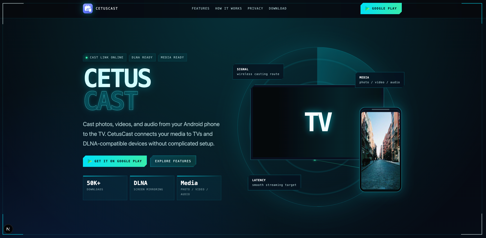

# CetusCast Landing Page

CetusCast landing page built with Next.js and React. The page uses a cinematic HUD visual system for a Google Play app that casts photos, videos, and audio from Android phones to TVs and DLNA-compatible devices.



## Tech Stack

- Next.js 16
- React 19
- TypeScript
- CSS
- Static export via `next.config.ts`

## Getting Started

Install dependencies:

```bash
npm install
```

Start the local development server:

```bash
npm run dev
```

Open `http://localhost:3000` in your browser.

## Build

The project is configured for static export with `output: "export"` in `next.config.ts`.

```bash
npm run build
```

The generated static site is written to:

```text
out/
```

## Deploy

Deploy the contents of `out/` to any static hosting provider or static web server.

For nginx, use the equivalent of:

```nginx
server {
    listen 80;
    server_name example.com;

    # Set this to the directory where you publish the generated out/ files.
    root <static-site-root>;
    index index.html;

    location / {
        try_files $uri $uri.html $uri/ =404;
    }
}
```

Replace `example.com` and `<static-site-root>` with values for your own environment.

## Project Structure

```text
cetuscast-landing/
├── app/
│   ├── globals.css      # Global visual system and responsive styles
│   ├── layout.tsx       # Root layout and metadata
│   ├── page.tsx         # Landing page UI and client-side animations
│   └── translations.ts  # Legacy translation content kept in the project
├── screenshots/         # README and project preview images
├── next.config.ts       # Next.js static export config
├── package.json         # Scripts and dependencies
└── README.md
```

## Notes

- Runtime visuals include a particle canvas, radar sweep, decode title animation, scroll reveal effects, and terminal-style typing.
- Remote placeholder imagery is loaded from public URLs configured in `next.config.ts`.
- Replace placeholder media with production app screenshots before publishing publicly.

## 中文说明

这是 CetusCast 的官方落地页项目，使用 Next.js + React 实现。页面目前是赛博 HUD 风格的单页宣传页，支持静态导出，构建产物可以部署到任意静态站点服务。

常用命令：

```bash
npm install
npm run dev
npm run build
```

本地开发地址为 `http://localhost:3000`，构建产物输出到 `out/` 目录。
